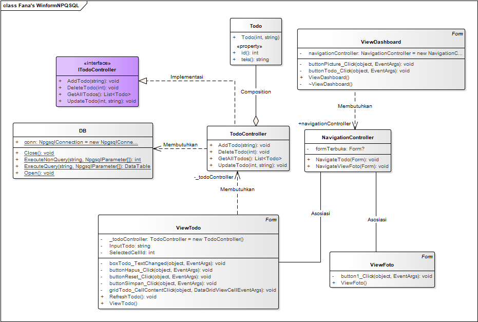

# WinformNPGSQL - Aplikasi Praktikum PBO C

## Class Diagram
   

## Struktur Projek
```
├── Controller
│   ├── ITodoController.cs    # Interface untuk controller todo
│   ├── NavigationController.cs # Kontrol navigasi antar form
│   └── TodoController.cs     # Implementasi operasi todo
├── Database
│   └── Database.cs           # Kelas helper untuk koneksi database
├── Model
│   └── Todo.cs               # Model data todo
├── View
│   ├── ViewDashboard.cs      # Form dashboard utama
│   ├── ViewFoto.cs           # Form tampilan gambar
│   └── ViewTodo.cs           # Form manajemen todo
```

## Cara Menjalankan
1. Pastikan PostgreSQL sudah terinstall dan berjalan
2. Buat database bernama "pbo" atau sesuaikan connection string di `Database/Database.cs`
3. Buat tabel todo dengan struktur:
   ```sql
   CREATE TABLE todo (
       id SERIAL PRIMARY KEY,
       teks VARCHAR(255) NOT NULL
   );
   ```
4. Jalankan aplikasi melalui Visual Studio atau build executable
